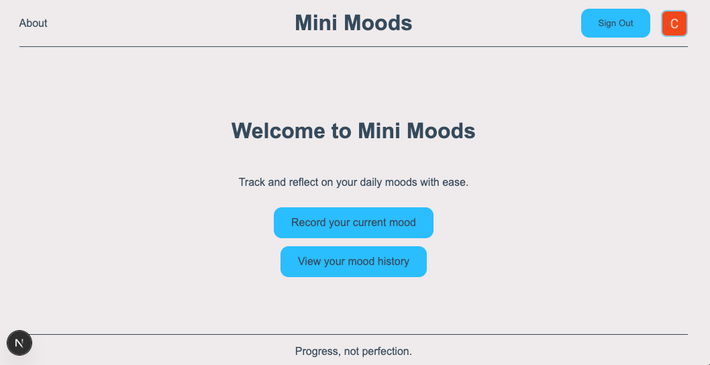
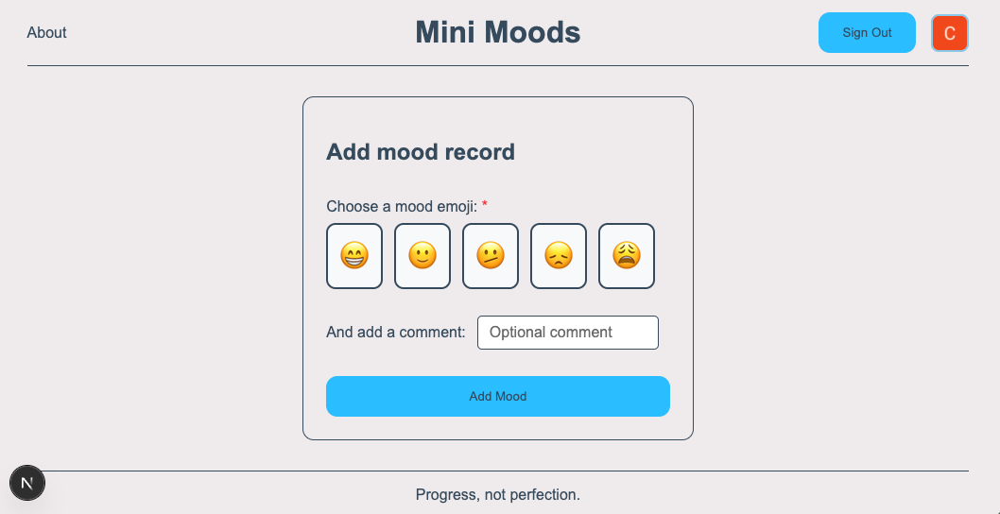
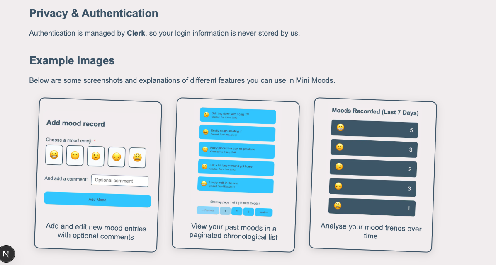

# Mini Moods

Hi! Mini Moods is a simple Next.js app for tracking daily moods.  
Each day (or multiple times a day), you can enter an emoji and an optional comment to record how you're feeling.  
Your entries are stored locally in a SQLite database using Prisma ORM, and you can view a history of your moods over time.

## Features

- Built with Next.js, TypeScript, Prisma, and SQLite
- Auth with Clerk
- CSS Modules for styling
- Create, update, and delete individual mood entries using client-side components hitting API routes, with an optional comment
- View paginated history of your mood entries using server-side components

## Screenshots





## Getting Started

1. **Install dependencies:**

   ```bash
   npm install
   ```

2. **Set up the database and .env file:**

   - Create a `.env` file in the project root:

     ```
     DATABASE_URL="file:/absolute/path/to/your/project/prisma/dev.db"
     ```

     Replace `/absolute/path/to/your/project` with the actual absolute path to a where you want your database to live. Relative paths seem to have issues at the moment with the runtime client being unable to resolve the same relative path. Using a dedicated hosted database would resolve this anyway.

   - Run Prisma migration or push the db file up without creating a migration:

     ```bash
     npx prisma migrate dev --name init
     npx prisma db push
     ```

   - Add the required Clerk url redirections:
     ```
     NEXT_PUBLIC_CLERK_SIGN_IN_URL=/sign-in
     NEXT_PUBLIC_CLERK_SIGN_IN_FALLBACK_REDIRECT_URL=/
     NEXT_PUBLIC_CLERK_SIGN_UP_FALLBACK_REDIRECT_URL=/
     ```

3. **Start the development server:**
   ```bash
   npm run dev
   ```

Open [http://localhost:3000](http://localhost:3000) to use the app.

## What's next

I built this in a few short sessions, so there are a few things to improve to get it to a more solid state:

1. Part way during the project, I migrated my GET API routes into just functions directly in the server component that used it. I would explore migrating the remaining API routes into server actions, and see about best practices here for handling forms in this case.

2. Add validation and sanitisation to the creating and updating mood entry logic to check the emoji value is one of the expected emojis, limit comment length, sanitise and trim comment content.

3. Add unit tests. Currently, it has none as a brief project to learn NextJS, Clerk and Prisma. At a bare minimium, ensure any actions are properly tested to improve maintainbility and reliability.

4. Connect up to a hosted database instead of the local sqlite db, and host the project.

And then a few items that would be next on the roadmap if I spent more time on it:

1. Improve the UX of existing functionality by adding confirmation dialogues, feedback on loading states, and better feedback on success/failure.

2. Add new functionality to the History page, including stats about most common emojis selected, how often moods are recorded, what days are more commonly happy days or sad days.

3. Add new functionality for admin users to be able to access a minimal summary of all data, so we can see trends across multiple users without exposing personal data in comments.

4. Add new functionality to include tags on moods and a filter function to find moods by tag.

5. Add a dark mode toggle. Currently, it only behaves based on the user's browser selection.
